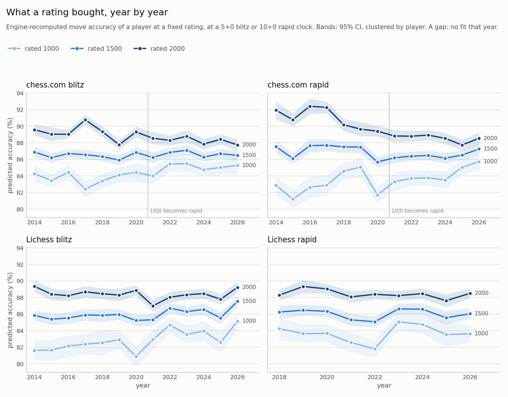
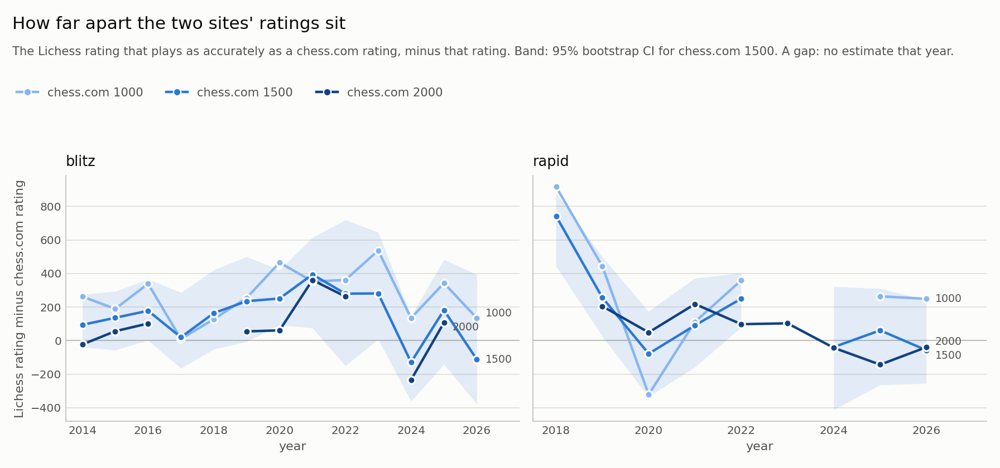
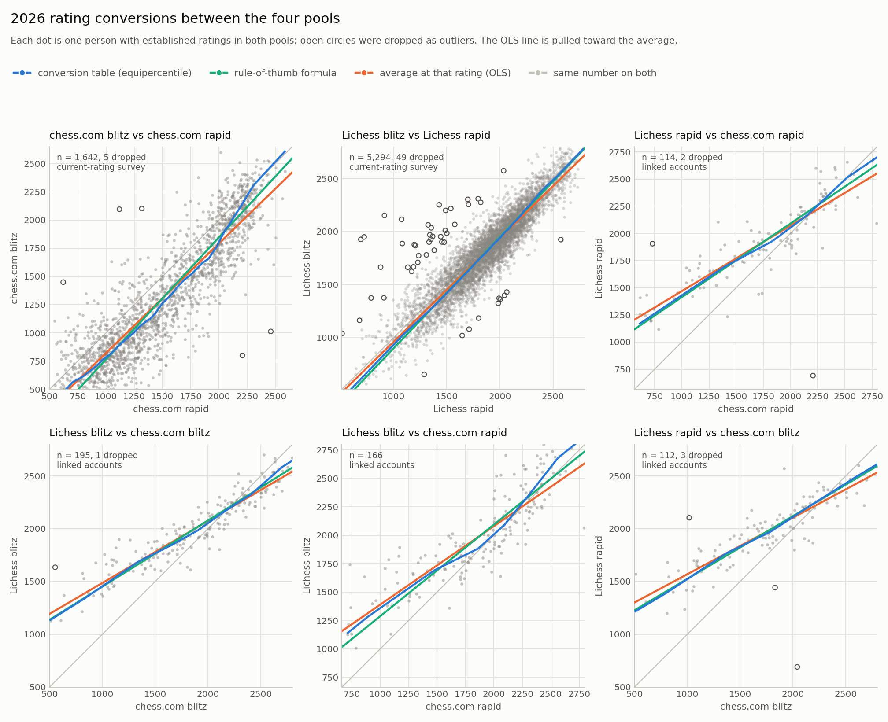
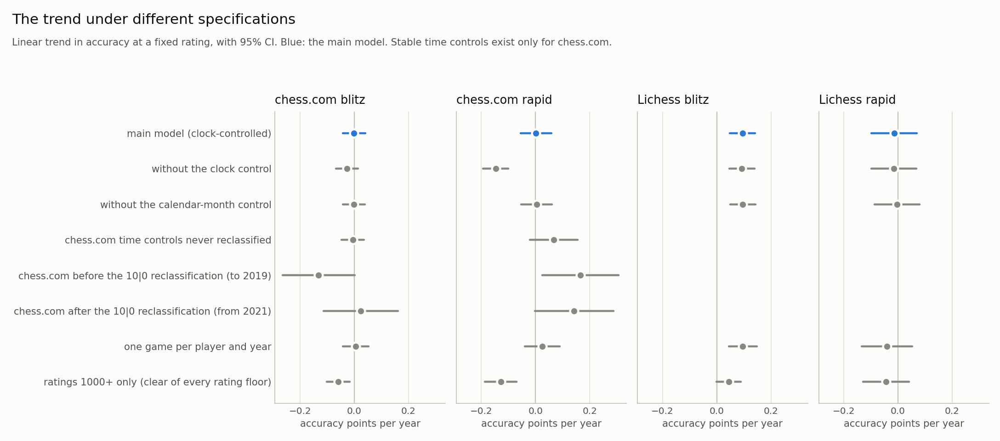
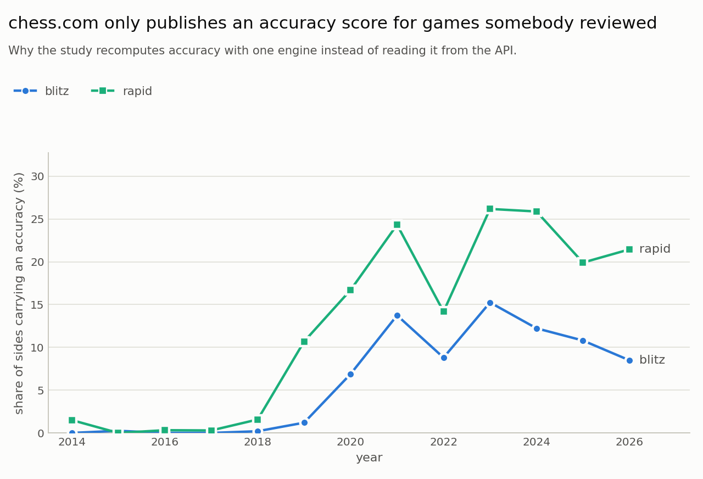

# What does a chess rating buy? chess.com and Lichess, 2014-2026

Built from 24,193 player-observations (19,127 games, 18,195 players) re-analysed with one engine, plus the 2026 rating surveys. Every number here is computed by `analysis/report.py`; re-running the report rewrites them.

## The answers

### 1. Year by year: does a given rating buy the same play as it used to?

- **chess.com blitz** (2014-2026): chess.com reclassified 10|0 as rapid on 2020-09-10, so each side is read on its own. Before (2014-2019): no detectable change (-0.131 accuracy points per year, 95% CI -0.264 to +0.001). After (2021-2026): no detectable change (+0.024 accuracy points per year, 95% CI -0.113 to +0.161). Across the break, a given rating played 0.35 points more accurately in 2021 than in 2019 (about 95% CI -0.81 to +1.52). One line across the whole span, for comparison: no detectable change (-0.001 accuracy points per year, 95% CI -0.042 to +0.041). A 1500 in 2014 played 0.51 points more accurately than a 1500 in 2026 (95% CI -0.32 to +1.34).
- **chess.com rapid** (2014-2026): chess.com reclassified 10|0 as rapid on 2020-09-10, so each side is read on its own. Before (2014-2019): a given rating buys more accuracy each year (+0.166 accuracy points per year, 95% CI +0.025 to +0.307). After (2021-2026): no detectable change (+0.143 accuracy points per year, 95% CI -0.002 to +0.288). Across the break, a given rating played 1.32 points less accurately in 2021 than in 2019 (about 95% CI -2.61 to -0.03), worth very roughly -220 rating points. One line across the whole span, for comparison: no detectable change (+0.002 accuracy points per year, 95% CI -0.055 to +0.060). A 1500 in 2014 played 0.24 points less accurately than a 1500 in 2026 (95% CI -1.20 to +0.73).
- **Lichess blitz** (2014-2026): a given rating buys more accuracy each year (+0.095 accuracy points per year, 95% CI +0.049 to +0.142). A 1500 in 2014 played 1.65 points less accurately than a 1500 in 2026 (95% CI -2.53 to -0.78), worth very roughly -300 rating points (an order of magnitude only).
- **Lichess rapid** (2018-2026): no detectable change (-0.014 accuracy points per year, 95% CI -0.098 to +0.070). A 1500 in 2018 played 0.15 points more accurately than a 1500 in 2026 (95% CI -0.77 to +1.07).

Negative means ratings have become easier to reach: the same number buys less accurate play now. Every comparison holds the rating and the clock fixed; see *Year by year* for each year.

### 2. chess.com against Lichess

At equal move accuracy in 2026, the Lichess rating sits this far from the chess.com one (Lichess minus chess.com, 95% bootstrap CI):

| cadence   | chess.com 1000     | chess.com 1500      | chess.com 2000     |
|:----------|:-------------------|:--------------------|:-------------------|
| blitz     | +135 (-95 to +420) | -110 (-380 to +395) |                    |
| rapid     | +250 (+20 to +490) | -55 (-255 to +240)  | -40 (-370 to +255) |

- blitz: across 13 years with an interval the offset at 1500 ranged from -130 (2024) to +395 (2021).
- rapid: across 8 years with an interval the offset at 1500 ranged from -80 (2020) to +740 (2018).

**Caution.** These offsets do not agree with the conversion fitted on people who hold accounts on both sites (part 3): in the accuracy cross-check, equating minus linked accounts has a median of -305 rating points (from -380 to -90 over 5 comparisons). At chess.com 1500 the offset moves by a median of 145 points between consecutive years (largest 485). The cause is a shallow accuracy-against-rating curve: one accuracy point is worth only about 165-230 rating points, so ordinary sampling noise in accuracy becomes a large rating error. To convert a rating between the sites, use the linked-account conversion in part 3; read the offsets above as rough evidence of which way and how far the sites differ, not as a conversion.

This is *accuracy equating*: the engine judges both sites' moves the same way, so the rating on each site that produces the same accuracy is matched. It is an independent estimate, not a head count of players who play on both sites -- that is part 3.

### 3. 2026 conversion formulas between the four pools

A rating in one pool is matched to the rating in another that sits at the *same percentile* among the people with established ratings in both (equipercentile linking). The match is symmetric, so converting there and back returns the starting rating, and it follows the relation where it bends.

**Rules of thumb.** Each formula is the straight line that matches the two pools' means and spreads (linear equating, the straight-line version of the same idea). Use it only inside its valid range; the last column says how far it strays from the table there.

| formula (rounded)                               | valid for   |   people | source                |   off the table by up to |
|:------------------------------------------------|:------------|---------:|:----------------------|-------------------------:|
| chess.com blitz ≈ -315 + 1.08 × chess.com rapid | 715–2305    |    1,642 | current-rating survey |                       70 |
| chess.com rapid ≈ 285 + 0.93 × chess.com blitz  | 565–2310    |    1,642 | current-rating survey |                       90 |
| Lichess blitz ≈ -151 + 1.05 × Lichess rapid     | 1105–2540   |    5,294 | current-rating survey |                       20 |
| Lichess rapid ≈ 133 + 0.96 × Lichess blitz      | 1035–2515   |    5,294 | current-rating survey |                       10 |
| Lichess rapid ≈ 732 + 0.68 × chess.com rapid    | 675–2530    |      114 | linked accounts       |                       45 |
| chess.com rapid ≈ -1076 + 1.47 × Lichess rapid  | 1230–2590   |      114 | linked accounts       |                       65 |
| Lichess blitz ≈ 820 + 0.63 × chess.com blitz    | 825–2700    |      195 | linked accounts       |                       25 |
| chess.com blitz ≈ -1307 + 1.59 × Lichess blitz  | 1370–2580   |      195 | linked accounts       |                       50 |
| Lichess blitz ≈ 476 + 0.81 × chess.com rapid    | 750–2535    |      166 | linked accounts       |                       85 |
| chess.com rapid ≈ -597 + 1.24 × Lichess blitz   | 1235–2705   |      166 | linked accounts       |                      105 |
| Lichess rapid ≈ 937 + 0.59 × chess.com blitz    | 810–2660    |      112 | linked accounts       |                       20 |
| chess.com blitz ≈ -1562 + 1.68 × Lichess rapid  | 1380–2525   |      112 | linked accounts       |                       30 |

_chess.com rapid and chess.com blitz: the relation bends, so the straight formula misses by up to 70 points inside its range; the table below is the better guide._

**Conversion table** (equipercentile). Each row is one rating in the first column's pool; 95% bootstrap interval in brackets.
`*` marks a rating outside the range where 95% of that pair's people sit (an extrapolation); `–` means the converted value would fall outside 500-2800, where nothing was fitted.

From **chess.com rapid**:

|   chess.com rapid | chess.com blitz   | Lichess rapid    | Lichess blitz    |
|------------------:|:------------------|:-----------------|:-----------------|
|               800 | 615 (595–640)     | 1295 (1240–1355) | 1210 (1115–1290) |
|              1000 | 785 (770–800)     | 1430 (1380–1475) | 1360 (1285–1435) |
|              1200 | 965 (945–985)     | 1565 (1515–1610) | 1500 (1435–1560) |
|              1400 | 1135 (1110–1165)  | 1695 (1640–1735) | 1640 (1580–1695) |
|              1600 | 1365 (1335–1395)  | 1805 (1760–1840) | 1755 (1710–1790) |
|              1800 | 1565 (1535–1595)  | 1910 (1875–1955) | 1850 (1820–1890) |
|              2000 | 1800 (1765–1840)  | 2050 (2015–2085) | 2010 (1965–2040) |
|              2200 | 2130 (2100–2155)  | 2210 (2175–2255) | 2225 (2175–2270) |

From **chess.com blitz**:

|   chess.com blitz | chess.com rapid   | Lichess rapid     | Lichess blitz     |
|------------------:|:------------------|:------------------|:------------------|
|               800 | 1025 (1000–1045)  | 1390 (1290–1485)* | 1320 (1285–1420)* |
|              1000 | 1245 (1220–1265)  | 1525 (1435–1585)  | 1455 (1420–1525)  |
|              1200 | 1455 (1430–1475)  | 1655 (1595–1695)  | 1590 (1560–1640)  |
|              1400 | 1630 (1605–1655)  | 1780 (1740–1815)  | 1720 (1685–1745)  |
|              1600 | 1835 (1805–1865)  | 1880 (1845–1910)  | 1820 (1790–1845)  |
|              1800 | 2000 (1980–2015)  | 1980 (1935–2025)  | 1925 (1900–1955)  |
|              2000 | 2115 (2100–2130)  | 2110 (2075–2145)  | 2055 (2020–2075)  |
|              2200 | 2240 (2225–2260)  | 2240 (2205–2280)  | 2195 (2165–2215)  |

From **Lichess rapid**:

|   Lichess rapid | chess.com rapid   | chess.com blitz   | Lichess blitz    |
|----------------:|:------------------|:------------------|:-----------------|
|             800 | –                 | –                 | 725 (700–745)*   |
|            1000 | –                 | –                 | 935 (910–955)*   |
|            1200 | 660 (560–745)*    | –                 | 1130 (1115–1145) |
|            1400 | 955 (875–1025)    | 815 (645–965)     | 1320 (1305–1330) |
|            1600 | 1255 (1190–1335)  | 1115 (1025–1205)  | 1525 (1515–1535) |
|            1800 | 1595 (1525–1665)  | 1435 (1375–1510)  | 1735 (1730–1745) |
|            2000 | 1930 (1870–1985)  | 1830 (1755–1900)  | 1940 (1930–1945) |
|            2200 | 2190 (2145–2230)  | 2135 (2080–2190)  | 2155 (2145–2165) |

From **Lichess blitz**:

|   Lichess blitz | chess.com rapid   | chess.com blitz   | Lichess rapid     |
|----------------:|:------------------|:------------------|:------------------|
|             800 | –                 | –                 | 870 (855–895)*    |
|            1000 | 540 (420–660)*    | –                 | 1065 (1045–1085)* |
|            1200 | 790 (680–900)*    | 610 (450–670)*    | 1275 (1260–1290)  |
|            1400 | 1060 (935–1150)   | 920 (770–970)     | 1480 (1470–1490)  |
|            1600 | 1345 (1260–1425)  | 1210 (1135–1260)  | 1675 (1665–1680)  |
|            1800 | 1695 (1625–1760)  | 1565 (1510–1620)  | 1865 (1860–1875)  |
|            2000 | 1990 (1955–2035)  | 1925 (1880–1970)  | 2055 (2050–2060)  |
|            2200 | 2180 (2150–2225)  | 2210 (2175–2250)  | 2235 (2225–2240)  |

These convert a *level*. An individual's actual rating in the other pool scatters around it: the typical 95% range is ±360 points, because people are genuinely better at one cadence or site than another. The per-pair spread is in `conversion_table.csv` (`typical_low`/`typical_high`).

## How it was measured

- Rated blitz and rapid games from chess.com and Lichess, 2014-2026, crawled from the same calendar months every year (March, June, September) with an equal quota per month, and every model controls for the calendar month as well. The quotas were not always met: these site-years still draw more than 60% of their rows from one month, so their year effects lean on the month control, or are confounded with the season where a pool has too few mixed years to estimate it: Lichess 2014 (61%).
- A player's rating is the one printed on that game. Each site's blitz and rapid are separate pools and are never pooled; nor are the two sites.
- Every game is re-scored with Stockfish at fixed depth 12, skipping the first 8 plies of book moves; accuracy is derived from that one pass.
- Ratings 600-2400; each side scored on at least 8 moves; at most 3 rows per player, site, year and cadence. Provisional Lichess ratings are dropped. Standard errors are clustered by player (site + username) throughout.
- Clock: every model controls for log(base + 40 × increment), and predictions are made at 5+0 blitz and 10+0 rapid. chess.com moved 10|0 from blitz to rapid on 2020-09-10 ([announcement](https://www.chess.com/news/view/10-minute-chess-now-rapid-rated-bullet-ratings-increased)) and each cadence's mix of controls keeps changing, so without this a year with longer games would look stronger. Before that date chess.com rapid was essentially 15-minute-plus games, so its 10+0 prediction for early years leans on the clock term.

What each inclusion rule removed:

| rule                                                        |   rows_removed |   rows_left |
|:------------------------------------------------------------|---------------:|------------:|
| collected                                                   |              0 |       41024 |
| accuracy scored on at least 8 moves                         |            943 |       40081 |
| blitz or rapid, with a known clock                          |              0 |       40081 |
| rating within 600-2400                                      |            363 |       39718 |
| rating pool existed that month (Lichess rapid from 2018-01) |              0 |       39718 |
| Lichess rating not provisional                              |           1016 |       38702 |
| at most 3 rows per player, site, year and cadence           |          14509 |       24193 |

Observations per year after the rules (Lichess rapid starts in 2018, when the pool was created):

|   year |   Lichess blitz |   Lichess rapid |   chess.com blitz |   chess.com rapid |
|-------:|----------------:|----------------:|------------------:|------------------:|
|   2014 |             600 |               0 |               473 |               394 |
|   2015 |             595 |               0 |               459 |               539 |
|   2016 |             535 |               0 |               530 |               440 |
|   2017 |             599 |               0 |               515 |               513 |
|   2018 |             459 |             450 |               556 |               466 |
|   2019 |             515 |             508 |               526 |               409 |
|   2020 |             549 |             566 |               489 |               466 |
|   2021 |             484 |             466 |               474 |               473 |
|   2022 |             552 |             546 |               558 |               496 |
|   2023 |             575 |             561 |               498 |               465 |
|   2024 |             537 |             538 |               478 |               499 |
|   2025 |             414 |             349 |               562 |               501 |
|   2026 |             569 |             588 |               398 |               461 |

## Year by year

One model per site and cadence: `accuracy ~ C(year) + rating + rating² + log(clock)`, clustered by player. The year coefficients compare each year with the reference year at the *same* rating and clock; the trend replaces them with a straight line in the year.

Two breaks sit inside these series. On chess.com, 10|0 became rapid on 2020-09-10 (the vertical line): rapid's share of play went from under a tenth to about a third, and players who moved over had their rapid rating set from their blitz rating. The chess.com trend is therefore also fitted on each side of it (*Robustness*). On Lichess, rapid began on 2017-12-01 with every player's rating copied from their Classical one, so 2018 rapid ratings still carry Classical's calibration.

**Trend** (accuracy points per year at a fixed rating):

| pool            | years          | trend per year            | p      |   slope per 100 rating |   ≈ rating points per year |   players |
|:----------------|:---------------|:--------------------------|:-------|-----------------------:|---------------------------:|----------:|
| chess.com blitz | 2014-2026 (13) | -0.001 (-0.042 to +0.041) | 0.98   |                   0.44 |                         +0 |      5250 |
| chess.com rapid | 2014-2026 (13) | +0.002 (-0.055 to +0.060) | 0.94   |                   0.6  |                         +0 |      4832 |
| Lichess blitz   | 2014-2026 (13) | +0.095 (+0.049 to +0.142) | <0.001 |                   0.54 |                        +20 |      5204 |
| Lichess rapid   | 2018-2026 (9)  | -0.014 (-0.098 to +0.070) | 0.74   |                   0.48 |                         -5 |      3465 |

The last-but-one column divides the trend by the accuracy-per-rating slope. That slope is a few tenths of a point per 100 rating, so it sits in the denominator of a ratio far less certain than the trend itself: read it as an order of magnitude, never as a figure.

**Each year against the reference year** (accuracy points at the same rating and clock; positive = that year's players were more accurate than today's at the same rating):

|   year | Lichess blitz          | Lichess rapid          | chess.com blitz        | chess.com rapid        |
|-------:|:-----------------------|:-----------------------|:-----------------------|:-----------------------|
|   2014 | -1.65 (-2.53 to -0.78) |                        | +0.51 (-0.32 to +1.34) | -0.24 (-1.20 to +0.73) |
|   2015 | -2.10 (-3.00 to -1.20) |                        | -0.13 (-0.97 to +0.71) | -1.44 (-2.35 to -0.53) |
|   2016 | -1.92 (-2.80 to -1.04) |                        | +0.44 (-0.31 to +1.19) | +0.10 (-0.94 to +1.14) |
|   2017 | -1.64 (-2.52 to -0.75) |                        | +0.30 (-0.52 to +1.12) | +0.33 (-0.60 to +1.26) |
|   2018 | -1.58 (-2.47 to -0.69) | +0.15 (-0.77 to +1.07) | +0.09 (-0.71 to +0.88) | +0.16 (-0.73 to +1.05) |
|   2019 | -1.53 (-2.39 to -0.68) | +0.38 (-0.50 to +1.27) | -0.43 (-1.24 to +0.37) | +0.07 (-0.85 to +0.99) |
|   2020 | -2.22 (-3.09 to -1.36) | +0.27 (-0.62 to +1.16) | +0.64 (-0.21 to +1.49) | -1.75 (-2.60 to -0.89) |
|   2021 | -2.23 (-3.14 to -1.32) | -0.75 (-1.65 to +0.16) | -0.08 (-0.93 to +0.77) | -1.25 (-2.15 to -0.35) |
|   2022 | -0.88 (-1.68 to -0.08) | -0.88 (-1.72 to -0.04) | +0.46 (-0.33 to +1.25) | -1.04 (-1.87 to -0.21) |
|   2023 | -1.22 (-2.04 to -0.41) | +0.58 (-0.27 to +1.43) | +0.74 (-0.09 to +1.57) | -0.96 (-1.81 to -0.12) |
|   2024 | -0.95 (-1.82 to -0.08) | +0.57 (-0.32 to +1.47) | -0.08 (-0.87 to +0.70) | -1.29 (-2.14 to -0.43) |
|   2025 | -1.99 (-2.86 to -1.11) | -0.52 (-1.48 to +0.45) | +0.31 (-0.47 to +1.08) | -0.93 (-1.81 to -0.05) |
|   2026 | reference              | reference              | reference              | reference              |

**Does the rating slope itself change?** If it does, the year gap depends on the rating it is read at. The drift column is the change in the accuracy-per-100-rating slope per year; the joint test asks whether one slope fits every year.

| pool            | slope first year   | slope last year   | drift per year            | one slope fits all years (p)   |
|:----------------|:-------------------|:------------------|:--------------------------|:-------------------------------|
| chess.com blitz | 0.53 (2014)        | 0.25 (2026)       | -0.030 (-0.038 to -0.021) | <0.001                         |
| chess.com rapid | 0.91 (2014)        | 0.28 (2026)       | -0.059 (-0.069 to -0.050) | <0.001                         |
| Lichess blitz   | 0.77 (2014)        | 0.41 (2026)       | -0.026 (-0.037 to -0.016) | <0.001                         |
| Lichess rapid   | 0.41 (2018)        | 0.49 (2026)       | -0.013 (-0.030 to +0.004) | 0.0017                         |

The slope changes over the years in chess.com blitz, chess.com rapid, Lichess blitz, Lichess rapid: there, the year gap differs by rating level, and the figure above (which lets every year have its own slope) is the better guide than a single number.

## chess.com against Lichess

For each year and cadence with at least 60 rows on both sites, each site's `accuracy ~ rating + rating² + log(clock)` curve is fitted separately, and a chess.com rating is matched to the Lichess rating with the same predicted accuracy at the same clock. Intervals: 95% bootstrap over players (300 replicates). A blank means the match falls outside the ratings sampled on the other site; an offset with no interval means more than 20% of replicates found no match.

Lichess minus chess.com rating at equal accuracy, by chess.com rating:

|   year | blitz 1000          | blitz 1500          | blitz 2000          | rapid 1000           | rapid 1500          | rapid 2000         |
|-------:|:--------------------|:--------------------|:--------------------|:---------------------|:--------------------|:-------------------|
|   2014 | +265 (+135 to +405) | +95 (-40 to +275)   | -25                 |                      |                     |                    |
|   2015 | +190 (-90 to +420)  | +135 (-55 to +295)  | +55 (-110 to +285)  |                      |                     |                    |
|   2016 | +340 (+135 to +530) | +180 (+0 to +365)   | +100 (-70 to +345)  |                      |                     |                    |
|   2017 | +10 (-155 to +155)  | +20 (-165 to +285)  |                     |                      |                     |                    |
|   2018 | +130 (-120 to +315) | +165 (-50 to +420)  |                     | +915 (+365 to +1270) | +740 (+445 to +880) |                    |
|   2019 | +255 (+50 to +450)  | +235 (-5 to +500)   | +55 (-205 to +300)  | +445 (+185 to +780)  | +255 (+25 to +500)  | +205               |
|   2020 | +465 (+280 to +660) | +250 (+95 to +420)  | +60 (-65 to +190)   | -320                 | -80 (-335 to +175)  | +50 (-210 to +265) |
|   2021 | +355 (-70 to +725)  | +395 (+75 to +615)  | +360                | +110 (-155 to +370)  | +90 (-160 to +370)  | +220               |
|   2022 | +360 (-5 to +840)   | +280 (-150 to +720) | +265                | +360 (+165 to +530)  | +250 (+75 to +400)  | +100 (-35 to +235) |
|   2023 | +535 (+240 to +840) | +280 (+5 to +645)   |                     |                      |                     | +105 (-55 to +305) |
|   2024 | +135 (-100 to +360) | -130 (-360 to +145) | -235 (-575 to +155) |                      | -40 (-415 to +320)  | -45 (-360 to +190) |
|   2025 | +345 (+80 to +600)  | +180 (-140 to +485) | +105 (-200 to +330) | +265                 | +60 (-265 to +310)  | -145 (-370 to +50) |
|   2026 | +135 (-95 to +420)  | -110 (-380 to +395) |                     | +250 (+20 to +490)   | -55 (-255 to +240)  | -40 (-370 to +255) |

Skipped because one site had fewer than 60 usable rows (rows on each site in brackets): rapid: 2014 (chess.com 394, Lichess 0), 2015 (chess.com 539, Lichess 0), 2016 (chess.com 440, Lichess 0), 2017 (chess.com 513, Lichess 0). Years with no games at all are not listed.

Equal accuracy is not equal standing in the pool: the claim is only that the two groups make moves of the same engine-judged quality at the same clock. The reverse direction (Lichess to chess.com) is in `site_offsets.csv`.

## 2026 conversion: details

**Who counts.** A rating enters only when it is established: at least 20 games in the pool, a rating deviation of at most 110 (Lichess's own provisional threshold, applied to both Glicko sites), last played within 183 days of the survey on chess.com or seen in 2026 on Lichess, and a Lichess account neither closed nor flagged. Same-month snapshots need 5+ games of each cadence that month. Pairs outside 500-2800 are left out of the fits (rating floors and titled outliers bend the line there).

**Sources:**

| source                         | file   |   records | established ratings                                                                         | notes                                                                                                                                                                                       |
|:-------------------------------|:-------|----------:|:--------------------------------------------------------------------------------------------|:--------------------------------------------------------------------------------------------------------------------------------------------------------------------------------------------|
| chess.com current ratings      | yes    |      8486 | chess.com rapid 2,788, chess.com blitz 2,973, both 1,740                                    | 8479 accounts found; 3917 dropped to keep at most 12 per hub account; fit on 1740 people with a recorded discovery cadence, 870 met in each of blitz and rapid games (471 others set aside) |
| Lichess current ratings        | yes    |     23518 | Lichess rapid 6,353, Lichess blitz 11,846, both 5,385                                       | 5227 closed, flagged or not seen in 2026                                                                                                                                                    |
| chess.com same-month snapshots | yes    |     15453 | chess.com rapid 53, chess.com blitz 53, both 53                                             |                                                                                                                                                                                             |
| Lichess same-month snapshots   | yes    |      7944 | Lichess rapid 51, Lichess blitz 51, both 51                                                 |                                                                                                                                                                                             |
| linked accounts                | yes    |       611 | chess.com rapid 245, chess.com blitz 310, Lichess rapid 195, Lichess blitz 358, all four 93 | 726 links, 172 dropped (account closed, flagged or not found)                                                                                                                               |

**Why this method.** Regressing one rating on the other answers a different question -- the *average* rating in the other pool of people at a given rating -- and is pulled toward the mean by everything that makes a person's two ratings disagree; the two regressions do not invert, so converting A to B and back does not return to A. That answer is still shown ("OLS slope", with its residual spread) as the typical-player prediction. The published conversion instead matches *percentiles* among the people who hold both ratings: the table matches them all (equipercentile linking, presmoothed, straight beyond the central 95%), the formula matches only the mean and spread (linear equating). Both are exact inverses of their reverse. A Deming fit with the RDs as error variances was the alternative; it assumes every difference between a person's two ratings is rating noise, but the residual spread below is several times the RDs -- most of it is genuine preference for a cadence or site -- so its slope is shown only as a sensitivity check.

**Outliers.** Before fitting, pairs further than 4 robust standard deviations from a median/MAD line are dropped (mostly wrong or stale links: ratings 800+ points apart where nearly everyone is within 200). The count per pair is in the table below; the dropped points are drawn as open circles in the figure.

**The fits:**

| pair                              | source                |   people |   outliers dropped |     r | formula slope (95% CI)   |   Deming slope |   OLS slope |   residual SD | straight line OK   |
|:----------------------------------|:----------------------|---------:|-------------------:|------:|:-------------------------|---------------:|------------:|--------------:|:-------------------|
| chess.com rapid → chess.com blitz | current-rating survey |     1642 |                  5 | 0.898 | 1.081 (1.057 to 1.103)   |          1.108 |       0.971 |           230 | no (max bend 100)  |
| Lichess rapid → Lichess blitz     | current-rating survey |     5294 |                 49 | 0.934 | 1.047 (1.035 to 1.059)   |          1.064 |       0.977 |           132 | yes (max bend 20)  |
| chess.com rapid → Lichess rapid   | linked accounts       |      114 |                  2 | 0.889 | 0.678 (0.623 to 0.739)   |          0.634 |       0.603 |           164 | yes (max bend 20)  |
| chess.com blitz → Lichess blitz   | linked accounts       |      195 |                  1 | 0.936 | 0.627 (0.598 to 0.659)   |          0.603 |       0.587 |           117 | yes (max bend 25)  |
| chess.com rapid → Lichess blitz   | linked accounts       |      166 |                  0 | 0.857 | 0.806 (0.740 to 0.873)   |          0.76  |       0.691 |           201 | yes (max bend 125) |
| chess.com blitz → Lichess rapid   | linked accounts       |      112 |                  3 | 0.901 | 0.595 (0.541 to 0.648)   |          0.554 |       0.536 |           137 | yes (max bend 0)   |

The relation bends noticeably for: chess.com rapid → chess.com blitz. There the straight formula is a compromise and the equipercentile table, which follows the bend, is the conversion to use.

**Consistency.** Converting through a third pool (for example chess.com rapid → Lichess rapid → Lichess blitz) should land near the direct formula. At 1500, the routes compare as follows; over 1000-2000 the largest gap is -145 points (Lichess blitz → chess.com blitz via chess.com rapid, at 2000). Gaps are expected: each pair is fitted on the people rated in *those two* pools. Each pair is shown once; the reverse direction is in `conversion_chains.csv`.

| from            | to              | via             |   direct |   chained |   discrepancy |
|:----------------|:----------------|:----------------|---------:|----------:|--------------:|
| chess.com rapid | chess.com blitz | Lichess rapid   |     1260 |      1342 |            82 |
| chess.com rapid | chess.com blitz | Lichess blitz   |     1260 |      1370 |           111 |
| chess.com rapid | Lichess rapid   | chess.com blitz |     1750 |      1695 |           -54 |
| chess.com rapid | Lichess rapid   | Lichess blitz   |     1750 |      1768 |            18 |
| chess.com rapid | Lichess blitz   | chess.com blitz |     1703 |      1633 |           -71 |
| chess.com rapid | Lichess blitz   | Lichess rapid   |     1703 |      1682 |           -21 |
| chess.com blitz | Lichess rapid   | chess.com rapid |     1831 |      1874 |            43 |
| chess.com blitz | Lichess rapid   | Lichess blitz   |     1831 |      1834 |             3 |
| chess.com blitz | Lichess blitz   | chess.com rapid |     1768 |      1818 |            50 |
| chess.com blitz | Lichess blitz   | Lichess rapid   |     1768 |      1765 |            -3 |
| Lichess rapid   | Lichess blitz   | chess.com rapid |     1420 |      1432 |            12 |
| Lichess rapid   | Lichess blitz   | chess.com blitz |     1420 |      1431 |            10 |

**Second source.** The same pair fitted on a different set of people; the sources disagree in places (largest gap 130 points).

| pair                              |   rating | published from        |   published | check from                |   check |   check people |   check minus published |
|:----------------------------------|---------:|:----------------------|------------:|:--------------------------|--------:|---------------:|------------------------:|
| chess.com rapid → chess.com blitz |     1000 | current-rating survey |         783 | 2026 same-month snapshots |     804 |             51 |                      21 |
| chess.com rapid → chess.com blitz |     1500 | current-rating survey |        1260 | 2026 same-month snapshots |    1351 |             51 |                      91 |
| chess.com rapid → chess.com blitz |     2000 | current-rating survey |        1802 | 2026 same-month snapshots |    1923 |             51 |                     120 |
| chess.com rapid → chess.com blitz |     1000 | current-rating survey |         783 | linked accounts           |     843 |            171 |                      60 |
| chess.com rapid → chess.com blitz |     1500 | current-rating survey |        1260 | linked accounts           |    1296 |            171 |                      36 |
| chess.com rapid → chess.com blitz |     2000 | current-rating survey |        1802 | linked accounts           |    1932 |            171 |                     130 |
| Lichess rapid → Lichess blitz     |     1000 | current-rating survey |         934 | 2026 same-month snapshots |     841 |             51 |                     -93 |
| Lichess rapid → Lichess blitz     |     1500 | current-rating survey |        1420 | 2026 same-month snapshots |    1380 |             51 |                     -41 |
| Lichess rapid → Lichess blitz     |     2000 | current-rating survey |        1938 | 2026 same-month snapshots |    1932 |             51 |                      -6 |
| Lichess rapid → Lichess blitz     |     1000 | current-rating survey |         934 | linked accounts           |     921 |            170 |                     -13 |
| Lichess rapid → Lichess blitz     |     1500 | current-rating survey |        1420 | linked accounts           |    1443 |            170 |                      23 |
| Lichess rapid → Lichess blitz     |     2000 | current-rating survey |        1938 | linked accounts           |    1948 |            170 |                      10 |

**Accuracy cross-check.** The same-cadence cross-site conversion from linked accounts, against the Lichess rating that plays as accurately in 2026 (part 2). The two use disjoint evidence -- people who play on both sites, versus how well each site's players move -- so agreement is meaningful and disagreement is a warning about one of them.

| cadence   |   chess.com rating |   Lichess, linked accounts | Lichess, accuracy equating   | equating minus linked   |
|:----------|-------------------:|---------------------------:|:-----------------------------|:------------------------|
| blitz     |               1000 |                       1455 | 1135 (905–1420)              | -320                    |
| blitz     |               1500 |                       1770 | 1390 (1120–1895)             | -380                    |
| blitz     |               2000 |                       2055 | n/a                          | n/a                     |
| rapid     |               1000 |                       1430 | 1250 (1020–1490)             | -180                    |
| rapid     |               1500 |                       1750 | 1445 (1245–1740)             | -305                    |
| rapid     |               2000 |                       2050 | 1960 (1630–2255)             | -90                     |

**Published comparison (not from this study's data).** ChessGoals rating comparison, updated July 2026 (https://chessgoals.com/rating-comparison/): a voluntary survey with usernames matched across sites and Lichess RD below 150; its values are typed in from the site, not recomputed. "Typical" is this study's OLS average for people at that rating, the closer analogue if the benchmark averages respondents.

| pair                              |   rating |   ChessGoals | this study (table)   |   this study (formula) |   this study (typical) |   table minus ChessGoals |
|:----------------------------------|---------:|-------------:|:---------------------|-----------------------:|-----------------------:|-------------------------:|
| chess.com blitz → Lichess blitz   |     1000 |         1425 | 1455 (1420–1525)     |                   1450 |                   1485 |                      +30 |
| chess.com blitz → Lichess blitz   |     1500 |         1755 | 1770 (1740–1795)     |                   1765 |                   1780 |                      +15 |
| chess.com blitz → Lichess blitz   |     2000 |         2080 | 2055 (2020–2075)     |                   2080 |                   2075 |                      -25 |
| chess.com blitz → Lichess rapid   |     1000 |         1615 | 1525 (1435–1585)     |                   1525 |                   1570 |                      -90 |
| chess.com blitz → Lichess rapid   |     1500 |         1905 | 1830 (1795–1860)     |                   1820 |                   1835 |                      -75 |
| chess.com blitz → Lichess rapid   |     2000 |         2165 | 2110 (2075–2145)     |                   2120 |                   2105 |                      -55 |
| chess.com blitz → chess.com rapid |     1000 |         1255 | 1245 (1220–1265)     |                   1215 |                   1245 |                      -10 |
| chess.com blitz → chess.com rapid |     1500 |         1655 | 1730 (1700–1760)     |                   1680 |                   1665 |                      +75 |
| chess.com blitz → chess.com rapid |     2000 |         1995 | 2115 (2100–2130)     |                   2145 |                   2080 |                     +120 |

## Robustness

The trend (accuracy points per year at a fixed rating) under alternative choices. Without the clock control, a shift in the time-control mix is read as a change in skill; the stable-controls row keeps only chess.com time controls whose class never changed; one game per player removes any weight from prolific accounts; ACPL is a second metric that does not depend on the accuracy formula (lower is better, so its sign is reversed).

| specification                                         | Lichess blitz             | Lichess rapid             | chess.com blitz           | chess.com rapid           |
|:------------------------------------------------------|:--------------------------|:--------------------------|:--------------------------|:--------------------------|
| main model (clock-controlled)                         | +0.095 (+0.049 to +0.142) | -0.014 (-0.098 to +0.070) | -0.001 (-0.042 to +0.041) | +0.002 (-0.055 to +0.060) |
| without the clock control                             | +0.093 (+0.046 to +0.140) | -0.015 (-0.099 to +0.068) | -0.027 (-0.067 to +0.014) | -0.147 (-0.193 to -0.101) |
| without the calendar-month control                    | +0.096 (+0.050 to +0.143) | -0.003 (-0.086 to +0.080) | -0.001 (-0.042 to +0.040) | +0.004 (-0.053 to +0.061) |
| chess.com time controls never reclassified            | n/a                       | n/a                       | -0.005 (-0.047 to +0.036) | +0.067 (-0.020 to +0.155) |
| chess.com before the 10|0 reclassification (to 2019)  | n/a                       | n/a                       | -0.131 (-0.264 to +0.001) | +0.166 (+0.025 to +0.307) |
| chess.com after the 10|0 reclassification (from 2021) | n/a                       | n/a                       | +0.024 (-0.113 to +0.161) | +0.143 (-0.002 to +0.288) |
| one game per player and year                          | +0.096 (+0.044 to +0.148) | -0.041 (-0.133 to +0.052) | +0.006 (-0.041 to +0.053) | +0.025 (-0.039 to +0.089) |
| ratings 1000+ only (clear of every rating floor)      | +0.044 (-0.001 to +0.090) | -0.044 (-0.129 to +0.041) | -0.059 (-0.102 to -0.016) | -0.128 (-0.186 to -0.070) |
| average centipawn loss instead of accuracy            | -1.162 (-1.494 to -0.831) | -0.563 (-1.147 to +0.021) | -0.265 (-0.541 to +0.010) | -0.137 (-0.496 to +0.221) |

## Shape check: band by year

Mean accuracy per 300-point band and year, with no model at all. A shape check on the regressions, not a set of findings: cells are small and players sit at different points within a band.

**chess.com blitz**

| band      |   2014 |   2015 |   2016 |   2017 |   2018 |   2019 |   2020 |   2021 |   2022 |   2023 |   2024 |   2025 |   2026 |
|:----------|-------:|-------:|-------:|-------:|-------:|-------:|-------:|-------:|-------:|-------:|-------:|-------:|-------:|
| 600-899   |  82.2  |  82.6  |  82.46 |  81.86 |  82.04 |  82.37 |  83.91 |  83.17 |  84.99 |  85.24 |  84.42 |  83.66 |  83.83 |
| 900-1199  |  84.03 |  84.48 |  85.7  |  82.85 |  83.59 |  85.67 |  85.01 |  84.43 |  85.3  |  85.21 |  84.04 |  84.3  |  85.54 |
| 1200-1499 |  87.27 |  85.82 |  86.01 |  85.98 |  85.02 |  85.43 |  87.24 |  85.9  |  85.52 |  85.8  |  85.4  |  86.54 |  86.37 |
| 1500-1799 |  86.15 |  87.08 |  86.97 |  87.29 |  87.79 |  85.81 |  86.69 |  85.06 |  87.94 |  85.56 |  85.81 |  86.72 |  85.56 |
| 1800-2099 |  89.49 |  87.82 |  87.93 |  89.49 |  89.77 |  86.1  |  89.63 |  88.46 |  87.08 |  89.53 |  87.33 |  87.75 |  86.43 |
| 2100-2399 |  89.75 |  89.73 |  90.27 |  92.85 |  89.84 |  88.44 |  89.75 |  89.36 |  88.67 |  89.4  |  88.42 |  89.14 |  88.87 |

**chess.com rapid**

| band      |   2014 |   2015 |   2016 |   2017 |   2018 |   2019 |   2020 |   2021 |   2022 |   2023 |   2024 |   2025 |   2026 |
|:----------|-------:|-------:|-------:|-------:|-------:|-------:|-------:|-------:|-------:|-------:|-------:|-------:|-------:|
| 600-899   |  81.4  |  79.8  |  79.64 |  80.98 |  84.43 |  84.67 |  80.04 |  81.36 |  81.76 |  82.97 |  81.18 |  84.15 |  85.76 |
| 900-1199  |  84.8  |  83.32 |  84.33 |  84.66 |  86.96 |  86.65 |  83.25 |  86.18 |  84.16 |  84.15 |  84.44 |  85.49 |  86.68 |
| 1200-1499 |  87.06 |  85.89 |  90.85 |  88.37 |  87.45 |  88.19 |  84.24 |  84.57 |  86.35 |  86.48 |  86.78 |  87.12 |  85.66 |
| 1500-1799 |  90.28 |  88.79 |  89.72 |  90.15 |  89.5  |  88.05 |  87.8  |  86.44 |  87.19 |  85.41 |  87.75 |  85.35 |  87.18 |
| 1800-2099 |  91.99 |  91.38 |  91.88 |  92.77 |  91.06 |  90.39 |  90.06 |  88.73 |  87.73 |  88.59 |  88.75 |  87.91 |  88.54 |
| 2100-2399 |  95.38 |  93.52 |  95.95 |  95.46 |  93.69 |  93.1  |  89.51 |  90.16 |  90.14 |  91.71 |  90.06 |  88.86 |  90.08 |

**Lichess blitz**

| band      |   2014 |   2015 |   2016 |   2017 |   2018 |   2019 |   2020 |   2021 |   2022 |   2023 |   2024 |   2025 |   2026 |
|:----------|-------:|-------:|-------:|-------:|-------:|-------:|-------:|-------:|-------:|-------:|-------:|-------:|-------:|
| 600-899   |  78.29 |  79.99 |  80.63 |  80.53 |  80.36 |  82.02 |  79.13 |  81.91 |  85.38 |  81.18 |  82.83 |  81.36 |  83.11 |
| 900-1199  |  81.87 |  82.68 |  82.2  |  83.04 |  82.81 |  81.94 |  80.96 |  84.04 |  82.29 |  85.29 |  83.31 |  82.86 |  86.22 |
| 1200-1499 |  86.14 |  83.39 |  86    |  84.42 |  84.91 |  85.71 |  83.58 |  84.04 |  87.04 |  86.44 |  85.65 |  84.88 |  87.38 |
| 1500-1799 |  87.16 |  85.99 |  85.75 |  86.26 |  86.79 |  86.51 |  86.5  |  85.36 |  86.68 |  85.68 |  88.12 |  86.64 |  87.7  |
| 1800-2099 |  88.29 |  87.87 |  86.72 |  87.77 |  87.86 |  87.62 |  88.21 |  86.38 |  87.23 |  87.63 |  87.72 |  87.31 |  88    |
| 2100-2399 |  89.42 |  89.27 |  89.61 |  88.93 |  89.03 |  88.62 |  90.8  |  88.27 |  88.13 |  89.14 |  88.34 |  88.82 |  88.94 |

**Lichess rapid**

| band      |   2018 |   2019 |   2020 |   2021 |   2022 |   2023 |   2024 |   2025 |   2026 |
|:----------|-------:|-------:|-------:|-------:|-------:|-------:|-------:|-------:|-------:|
| 600-899   |  83.95 |  83.11 |  82.47 |  80.77 |  79.34 |  86.18 |  84.13 |  82.76 |  81.36 |
| 900-1199  |  84.9  |  83.8  |  83.45 |  82.81 |  82.58 |  83.36 |  84.8  |  84.2  |  85.03 |
| 1200-1499 |  84.48 |  85.25 |  86.54 |  86.17 |  85.22 |  85.53 |  86.31 |  84.61 |  85.26 |
| 1500-1799 |  86.51 |  87.43 |  86.93 |  85.24 |  85.69 |  88.47 |  86.21 |  85.15 |  88    |
| 1800-2099 |  87.74 |  89.05 |  88.99 |  87.99 |  87.86 |  87.39 |  88.42 |  87.46 |  87.28 |
| 2100-2399 |  90.02 |  90.88 |  89.97 |  89.18 |  90    |  89.29 |  89.58 |  89.18 |  89.33 |

## Why accuracy was recomputed

chess.com's own accuracy exists only for games somebody ran a review on, its formula has changed over the years, and Lichess publishes none through the same archive. Comparing years or sites on it would compare the games people chose to review, across a moving formula. Every game is therefore re-scored with one engine at one depth.

Share of chess.com sides carrying a reported accuracy:

|   year | blitz       | rapid      |
|-------:|:------------|:-----------|
|   2014 | 0% of 804   | 2% of 534  |
|   2015 | 0% of 798   | 0% of 812  |
|   2016 | 0% of 908   | 0% of 630  |
|   2017 | 0% of 916   | 0% of 696  |
|   2018 | 0% of 1010  | 2% of 636  |
|   2019 | 1% of 996   | 11% of 580 |
|   2020 | 7% of 842   | 17% of 778 |
|   2021 | 14% of 786  | 24% of 748 |
|   2022 | 9% of 932   | 14% of 818 |
|   2023 | 15% of 892  | 26% of 764 |
|   2024 | 12% of 834  | 26% of 850 |
|   2025 | 11% of 1000 | 20% of 844 |
|   2026 | 8% of 636   | 21% of 774 |

Where both numbers exist (n = 1185), the recomputed accuracy tracks chess.com's (Pearson r = 0.72, Spearman rho = 0.79): the instrument measures the same thing on a different scale (mean 87.3 here against 74.6 reported).

## What this cannot tell you

- **Survivorship, worse the further back.** Old games can only be read from accounts that still exist. Players who quit and closed their account are invisible, and a 2014 sample is more filtered than a 2025 one.
- **Activity weighting.** The crawler walks the opponent graph, so a player with a hundred games that month is likelier to be sampled than one with three. The sample describes the opposition you would actually meet at a rating, not a uniform draw over accounts.
- **Clustered sampling.** Each account's month is read newest first, so games bunch towards the end of the month and around a few very active accounts and their opponents. Errors are clustered by player, which covers repeated players but not whole communities, so a single year can move by a point or two for no reason; read the trend, not one year.
- **Accuracy is not strength.** It rewards quiet, forcing and simplified positions. If the *style* of play at a rating changed -- more theory, sharper openings, more time trouble -- accuracy moves without strength moving.
- **One engine, one depth.** Stockfish at depth 12 makes the scale identical across years and sites, which is what the comparison needs; the absolute numbers are not chess.com accuracies and should not be quoted as such.
- **Cadence boundaries moved.** chess.com reclassified 10|0 from blitz to rapid on 2020-09-10, seeding movers' rapid ratings from blitz. The clock control, the stable-controls check and the before/after trends address the time controls, but the *players* who followed 10|0 into rapid changed that pool's composition, which no control removes.
- **Lichess rapid only exists from 2018,** and began ([2017-12-01](https://lichess.org/blog/Wh9KWiQAAI5JrKVn/introducing-rapid-ratings)) as a copy of each player's Classical rating. Before it, the Lichess API labels 10+0 games "rapid" by today's speed rules while their rating is a Classical one; those rows are excluded, not relabelled. Lichess also estimated game length as base + 30 × increment before 2015-04-24 (40 × since), so a few early games sit in a different cadence than they were rated in.
- **Rating systems changed.** Lichess's rating floor fell from 800 to 600 (2019-06-28) and to 400 (2023-03); its new accounts start with a larger RD since September 2020; and a first-move advantage entered its Glicko-2 in November 2025 ([changelog](https://lichess.org/page/changelog-2025)). chess.com lets new accounts pick a starting rating. A year effect is the combined result of pool composition and such administrative changes, which this design cannot separate; the ratings-1000-and-up check keeps clear of the floors.
- **Linked accounts are self-selected.** Only people who declare their chess.com account on Lichess enter the cross-site conversion, and they are likely more serious and more active than average.
- **The rating survey is a cross-section, not a panel.** It pairs each person's current ratings; it says how the pools relate in the survey year, not how any person's ratings evolved.
- **Equal accuracy is not equal rating.** The site comparison equates move quality, not results against a common opponent; the conversion formulas equate people, not moves. Where the two agree, both are more credible.

## Files

Tables (CSV, full precision):

- `tables/sample_attrition.csv`
- `tables/sample_sizes.csv`
- `tables/year_effects.csv`
- `tables/accuracy_at_ratings.csv`
- `tables/year_trends.csv`
- `tables/slope_drift.csv`
- `tables/band_by_year.csv`
- `tables/site_offsets.csv`
- `tables/conversion_formulas.csv`
- `tables/conversion_table.csv`
- `tables/conversion_chains.csv`
- `tables/conversion_source_agreement.csv`
- `tables/conversion_accuracy_check.csv`
- `tables/conversion_benchmark.csv`
- `tables/conversion_sources.csv`
- `tables/reported_accuracy_coverage.csv`

Figures:

- `figures/accuracy_by_year.png`
- `figures/trend_robustness.png`
- `figures/site_offsets.png`
- `figures/conversion_2026.png`
- `figures/reported_accuracy_coverage.png`
